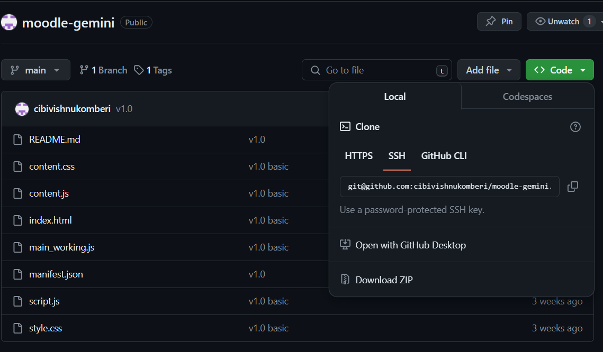
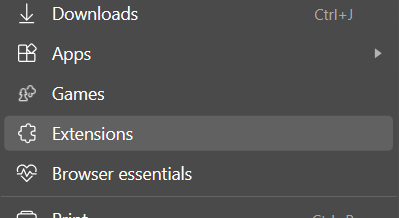
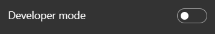
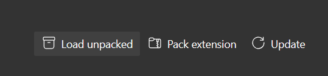
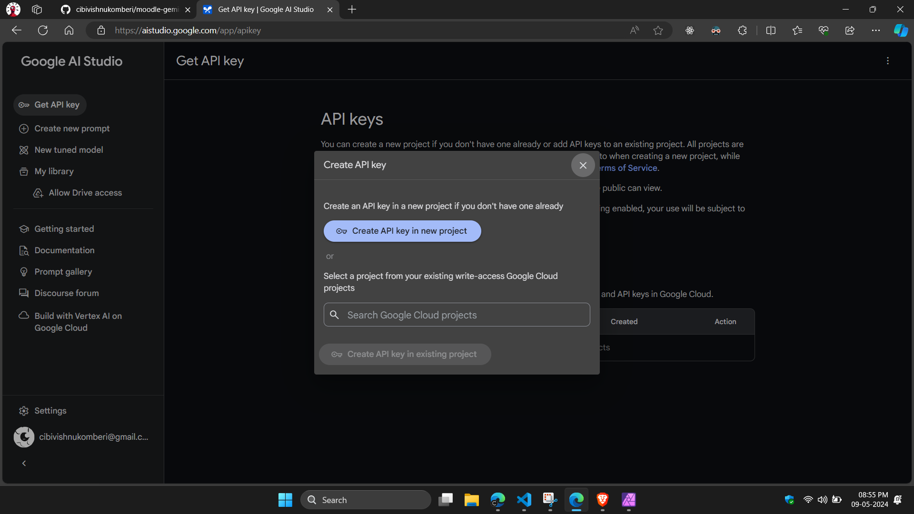
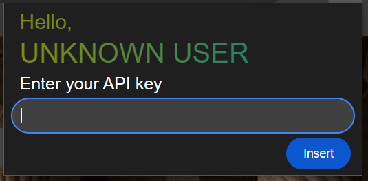
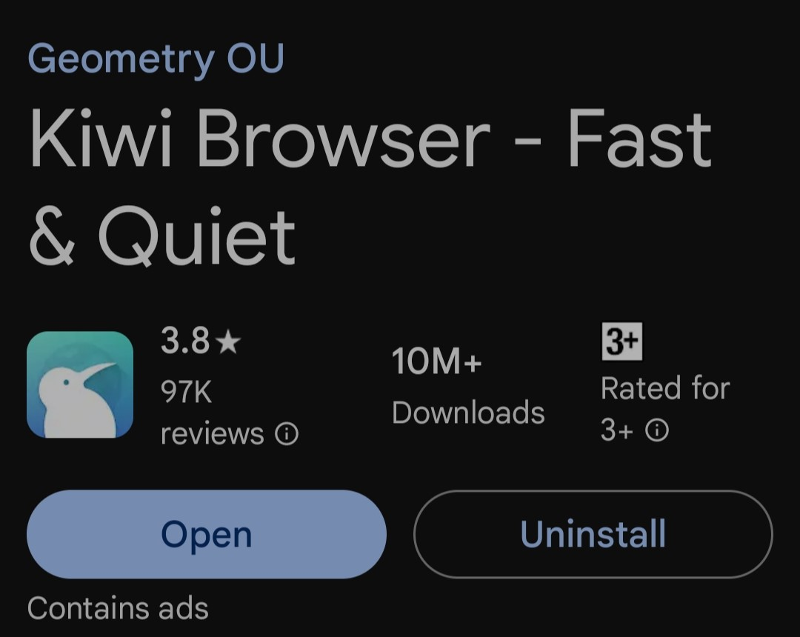
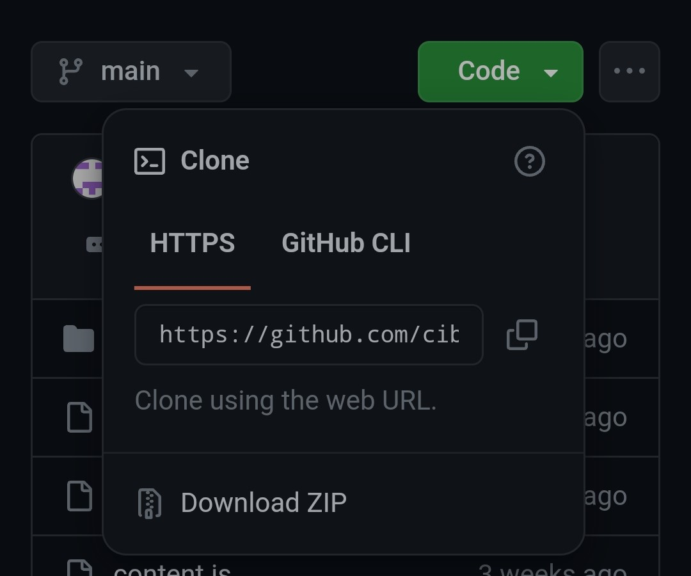
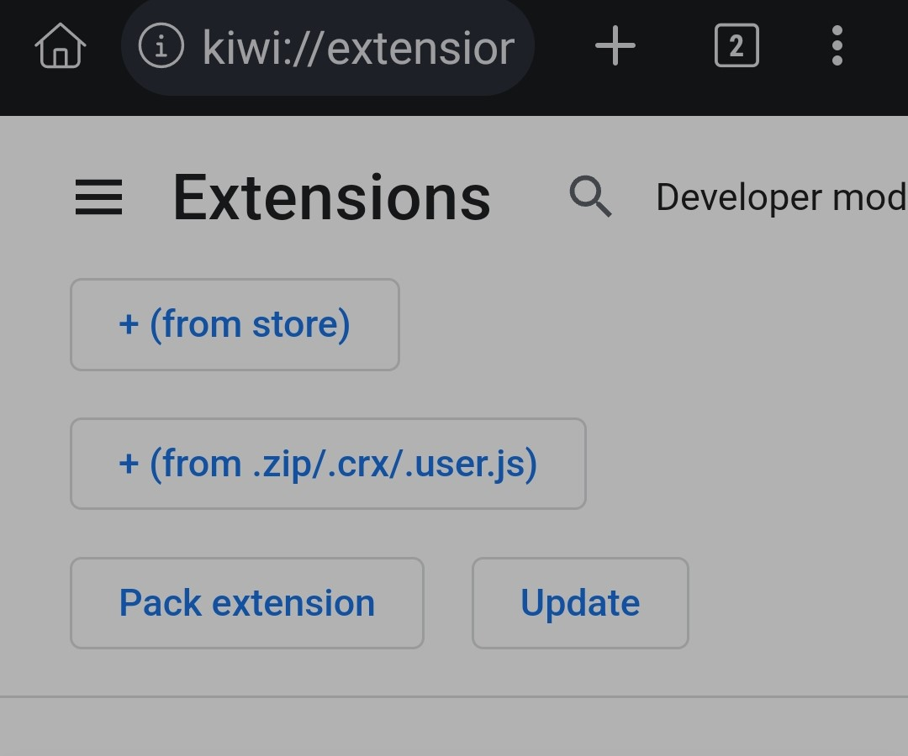
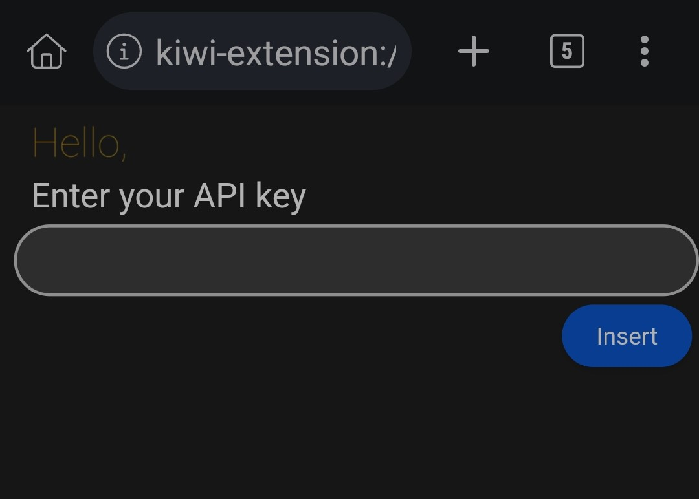

# Quick start

## For Windows

- **Download as zip and extract it**  
  

- **Go to Extension Settings in your browser**  
  

- **Enable Developer mode**  
  

- **Select load unpacked**  
  

- **Get an API key from https://aistudio.google.com/app/apikey and copy the API key**  
  

- **Insert the API key in the text field**  
  

## For Android

- **Install Kiwi browser or any other browser with extension support**  
  

- **Download as zip**  
  

- **Select +(from .zip) and select the downloaded zip file**  
  

- **Get an API key from https://aistudio.google.com/app/apikey and copy the API key**  
  

- **Insert the API key in the text field**  
  

# Disclaimer

- **Answers are generated using Gemini AI. They might be inaccurate**
- **These answers are not the actual answers**
- **Images in question and answers are not considered while generating response**
- **Image support will be added shortly**
